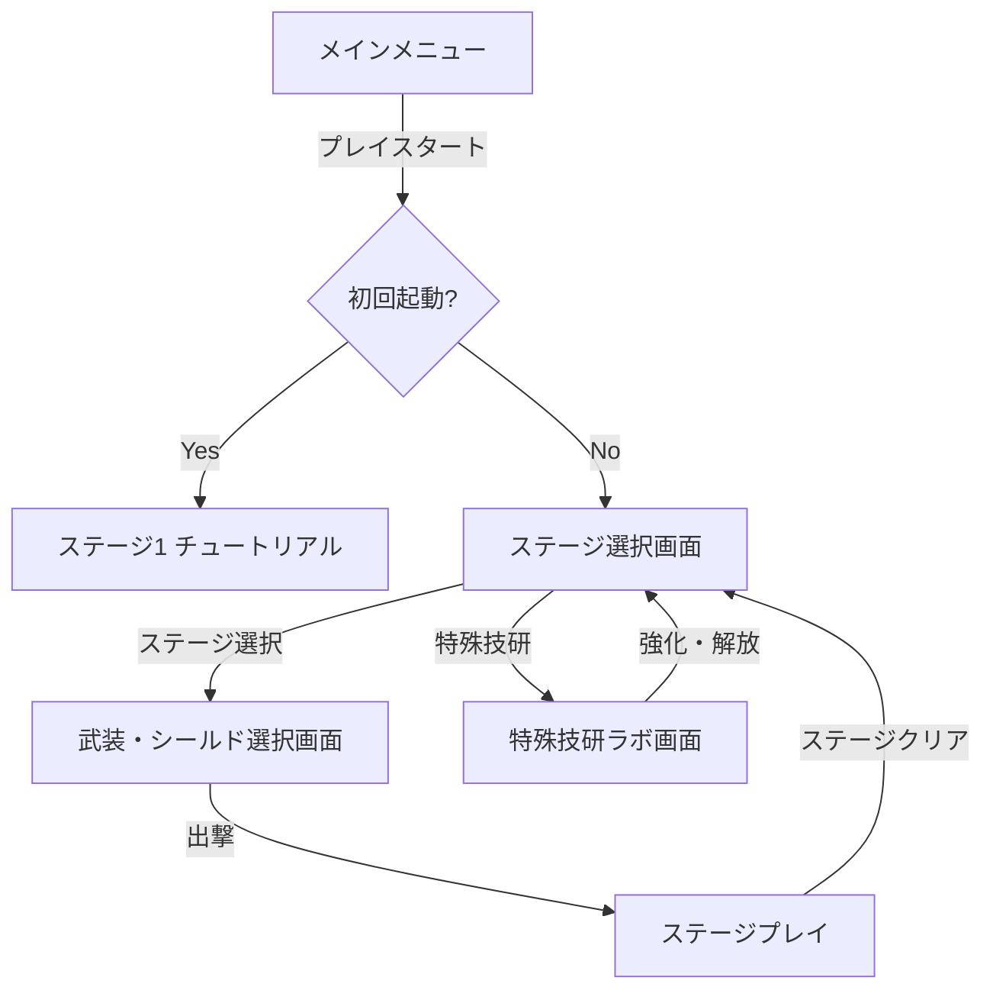

# COUNTER CORE - 新仕様・設計ドキュメント

本作は「避ける」のではなく「奪う（パリィ）」ことを主戦術とする、ジャストガード反撃型シューティングゲームです。本ドキュメントは更新された実装方針に基づく全体仕様と開発ロードマップをまとめます。

---

## ゲームシステム全体フロー

---

## 1. メインメニュー
*   **構成要素**: 「PLAY START」および「SETTINGS」ボタンのみのシンプルな構成。
*   **プレイ遷移の仕様**:
    *   **初回起動時**: 即座に「ステージ1（チュートリアル）」に遷移。
    *   **2回目以降の起動時**: 「ステージ選択画面」に遷移。

## 2. ステージ選択画面
*   **ビジュアル**: 世界観（ディストピア、あるいはサイバーパンクな古代遺構）が伝わるような背景グラフィック。
*   **操作UI**:
    *   画面下部中央にステージリストが配置され、左右のスクロール表示。
    *   コントローラーの十字キーやキーボードの左右キーによるスワイプアニメーションで選択していくインタラクティブなUI。
*   **ラボ遷移**: この画面から「**特殊技研（ラボ）**」画面へ遷移可能。

## 3. ステージ1（チュートリアル）
*   **初回起動時限定**: 初めて起動した際のみ、プレイプレビューを兼ねたチュートリアルステージとして動作。
*   **スローモーション演出**:
    *   パリィ（ジャストガード）の感覚をプレイヤーに掴んでもらうため、**敵弾がプレイヤーのパリィ範囲（パリィリング）に重なる直前からパリィが実行されるまでの間、ゲームスピードを極端にスローモーションにする**演出を実装。
    *   これにより、適切な入力タイミングを直感的に学習可能にする。

## 4. 武装・シールド選択画面（ステージ選択後）
ステージを選択した直後に、出撃前のカスタマイズを行う画面。

### A. 武器の「枠」（メイン武器）
初期状態のメイン射撃を行う武装。以下のバリエーションを実装予定。
*   **マシンガン**: 連射力重視。
*   **ライフル**: 単発火力・射程重視（バースト仕様など）。
*   **パルス**: 広角または拡散射撃。
*   **プラズマ**: 高熱・持続型ダメージ。
*   **少量タックル**: 近接・突撃による直接攻撃用武装。
*   **初期性能制限**: プレイヤーの基本武装は**最初はまっすぐにしか飛ばず、連射力も低い**状態からスタートする。雑魚敵の撃破や攻撃のパリィ・解析を通して弾道変異（拡散・ホーミング等）や連射力強化を獲得していく。
*   *攻撃開放仕様*: ステージ開始時は「攻撃機能」はロックされており、**ステージ内で最初のパリィを成功させて初めて攻撃が開始される**。

### B. COUNTER SYSTEM（反撃兵装）
パリィによってチャージ・解放される特殊兵装。
*   **仕様**: 各ステージでボス武器を2種類用意。
*   **ボス数**: 各ステージに2〜4体のボスを配置。
*   **解放条件**: 
    1. 特定のボスを複数回撃破する。
    2. 特定の部位破壊を一定回数成功させ、技術・データを解析する。
*   上記条件を満たすことで、そのボス武器が COUNTER SYSTEM の選択肢としてアンロックされ、出撃前に装備可能になる。

### C. シールド選択（防御・反射デバイス）
プレイヤーの防御スタイルを決定するデバイスの選択。
*   **カウンター特化型**: パリィ成功時の反射ダメージや反撃威力を最大化。
*   **ゲージ回収型**: パリィによる反撃ゲージや強化エネルギーの回収速度を大幅に向上させる（ただし反射威力は控えめ）。
*   **初期装備強化型**: パリィそのものの威力よりも、メイン武器の「枠」の基礎性能を引き上げるバフを付与する。

---

## 5. 音声アシストAI（ナビゲーター）
*   ステージスタート時や、ゲーム中の特定状況（ピンチ、ボス出現、部位破壊成功など）でプレイヤーに語りかける音声アシストAIを実装。
*   画面上にHUDとしてメッセージ表示し、世界観の深みとプレイングへのガイドを両立させる。

---

## 6. エネミー（雑魚敵・ボス）の仕様

### A. 雑魚敵
*   **本質**: 「プレイヤーの基礎能力の強化、および攻撃パターンの解析を行い、ホーミングなどの個性を各武器に持たせるための資源」。
*   **出現数と難易度（歯ごたえのある戦闘）**:
    *   **出現数の増加**: ウェーブごとの出現数を増やし、群れをなして画面を覆うような密度の高い配置を行う。
    *   **個体の強化**: 各個体の耐久値（HP）や弾速、攻撃精度を引き上げ、プレイヤーにパリィや立ち回りを強く意識させる歯ごたえのある難易度にする。
*   **個体ごとの固有射撃スタイル**: 敵の種別ごとに明確かつ固有の射撃スタイルを持たせ、画面上の弾幕パターンに多様性を与える。
    *   *チャージショット*: 溜め動作の後の高速単発高威力弾。
    *   *まっすぐ*: 基本的な直進高密度弾幕。
    *   *不規則*: 途中から速度や軌道が変化するトリッキーな弾。
    *   *薙ぎ払いレーザー*: 画面の広範囲を薙ぎ払うように発射されるレーザー。
    *   *拡散・波状弾幕*: プレイヤーの移動先を制限する波状の面攻撃。
*   **武器変異への還元**: どの射撃スタイルを持つ雑魚敵をどう倒すか、またはどの攻撃をパリィするかによって、プレイヤーの「初期はまっすぐ・低連射」な武器の特性（連射力アップ、ホーミング、拡散等）が成長・変異する。

### B. 巨大ボス
*   **スケール**: 画面から見切れるほどの超巨大サイズ。
*   **能力仕様**: 基礎能力の強化は行われない。
*   **部位破壊システム**: ボスの特定の武装や装甲を破壊可能。部位破壊により、ボス攻撃が弱体化したり、COUNTER SYSTEM 武器の解析率が上昇したりする。
*   **COUNTER SYSTEM (ボス戦中専用アクション)**:
    *   ステージ中、**ボス戦で1回のみ**使用可能。
    *   強力な超反撃（フルバースト）を発動し、大ダメージを与える。

---

## 7. 特殊技研（ラボ）画面
ステージ選択画面から遷移できる成長・カスタマイズ要素。
*   **自武器の解放**: 新たなメイン武装のアンロック。
*   **パリィの強化**: パリィ判定範囲の拡大、受付フレームの延長など。
*   **基礎能力の底上げ**: 最大HPの増加、パリィのクールダウン時間短縮など。
*   *リソース*: ステージクリアやボス撃破、部位破壊等で得られる「解析技術ポイント」を消費して強化を行う。

---

**作成日**: 2026-07-19  
**バージョン**: Design Specification v1.0  
