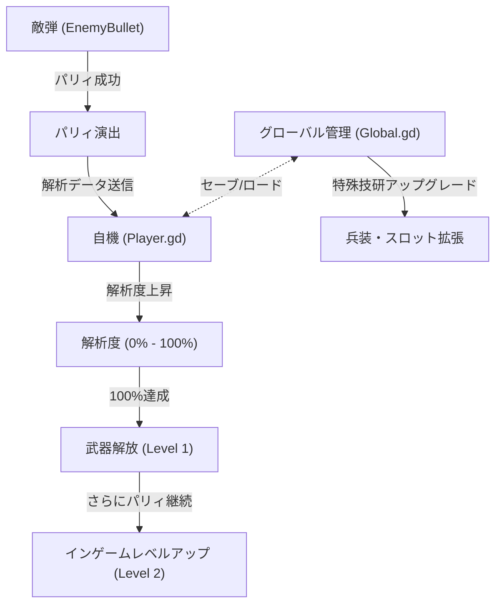

# 武器・弾幕システム詳細設計書 (Bullets & Weapons System Design)

本ドキュメントは、ジャストガード反撃型STGにおける「武器の解析・解放・強化システム」および「特殊技研」に関する詳細設計をまとめたものです。

---

## 1. システム概要 & アーキテクチャ

本ゲームの武器システムは、敵の弾幕を「パリィ（ジャストガード）」することでデータを収集し、自機の武装として複製・利用する独自のメカニクスを核としています。



---

## 2. 武器スロット & 装備制限の設計

### スロット構成
自機には以下の兵装スロットが用意されます。

*   **基本兵装スロット（常時有効）**:
    *   **実弾マシンガン (STANDARD MACHINE GUN)**: 初期から常時射撃される基本ショット。
*   **特殊兵装スロット（枠の拡張が可能）**:
    *   **スロット1 (初期解放)**: パリィで解析された特殊武器を1つ選択可能。
    *   **スロット2 (特殊技研で解放)**: 2つ目の特殊武器を搭載可能。
    *   **スロット3 (特殊技研で解放)**: 3つ目の特殊武器を搭載可能。

### インゲーム切り替え
*   プレイヤーはキー入力（`Shift` / `Z` / `C`）により、現在アクティブな特殊兵装スロットを巡回切り替え（トグル）します。
*   基本兵装（マシンガン）は特殊兵装の選択状況に関わらず、常に一定の間隔で自動発射されます。

---

## 3. インゲーム解析・レベルアップ仕様

### 解析プロセス
パリィが成功した際、敵弾の `bullet_type` に応じて自機の該当武器の解析度 (`progress`) が上昇します。

```gdscript
# プレイヤー内の武器データ構造モデル (Player.gd)
var weapons: Dictionary = {
    "beam": {
        "analyzed": false,   # 解析完了フラグ
        "progress": 0.0,     # 解析度 (0.0 ~ 100.0)
        "level": 1,          # インゲーム戦闘中レベル (1 = 通常, 2 = 強化)
        "parry_count": 0     # 解放後の追加パリィカウント
    },
    "missile": {
        "analyzed": false,
        "progress": 0.0,
        "level": 1,
        "parry_count": 0
    }
}
```

### インゲーム強化（解析の継続）
解析完了（`progress >= 100.0`）して武器が解放された後も、同タイプの敵弾をパリィし続けることで武器レベルが **LV 2** へとシフトします。

| 武器種 | レベル1 (通常) | レベル2 (解析強化) |
| :--- | :--- | :--- |
| **ビーム (BEAM)** | 標準直線レーザー (単発・中ダメージ) | **ギガレーザー (極太・貫通・極大ダメージ)** |
| **ミサイル (MISSILE)** | 追尾ミサイル (2発同時発射) | **ハイパーミサイル (4発発射・着弾時爆発スプラッシュ)** |
| **マシンガン (MACHINE GUN)** | 正面への標準的な連射 | **基礎能力強化連動 (発射速度+25% / 扇状スプレッド弾幕)** |

> **[!NOTE]**
> ボス戦における「部位破壊」を達成した際にも、該当する属性の武器データが即座にオーバーロードされ、強制的に **LV 2（強化状態）** へとアップグレードされます。

---

## 4. 特殊機能開放「特殊技研（仮）」の永続アップグレード設計

インターミッション（出撃前画面）に位置する「特殊技研」では、ステージで獲得したデータ残量（スコア/クレジット）を消費して自機と武器の永続的な強化・解放を行えます。

### 強化カテゴリ
1.  **兵装スロット拡張 (Slot Expansions)**:
    *   **第2スロット解放**: 2つ目の特殊兵装スロットを使用可能にし、インゲームでの複数武器運用を可能にする。
    *   **第3スロット解放**: 特殊兵装スロットの最大拡張。すべての特殊武器を戦闘中に切り替え可能にする。
2.  **特殊武器の強制先行アンロック (Initial Weapon Unlock)**:
    *   特定の武器の解析データを最初から一部、または100%解放した状態で出撃可能にする。
3.  **武器別性能強化（現在検討中の項目）**:
    *   *威力強化*: 各武器の基本ダメージを+10% / +20% / +30% と段階強化。
    *   *発射レート向上*: 自動射撃の間隔を短縮。
    *   *機能拡張*: ミサイルの旋回性能向上、ビームのチャージ時間短縮など。

---

## 5. 実装用クラス・データ設計 (GDScript)

### A. プレイヤー武器発射ロジックの拡張案 (`Player.gd`)

```gdscript
func fire() -> void:
    # 1. 基本兵装は常に発射
    fire_standard_machinegun()
    
    # 2. 選択中の特殊兵装が解析済であれば発射
    if current_weapon != "none" and weapons[current_weapon]["analyzed"]:
        match current_weapon:
            "beam":
                if weapons["beam"]["level"] == 1:
                    fire_normal_beam()
                else:
                    fire_giga_beam()
            "missile":
                if weapons["missile"]["level"] == 1:
                    fire_normal_missiles()
                else:
                    fire_hyper_missiles()
```

### B. 敵弾のジャストガード判定 & 信号送信 (`EnemyBullet.gd`)

```gdscript
func convert_to_friendly() -> void:
    if is_friendly:
        return
    is_friendly = true
    velocity = -velocity * 3.0 # 反転・加速
    update_bullet_color()
    
    # プレイヤーの解析進行メソッドをコール
    var player = get_node_or_null("/root/Main/Player")
    if is_instance_valid(player) and player.has_method("advance_analysis"):
        player.advance_analysis(bullet_type, 34)
```
