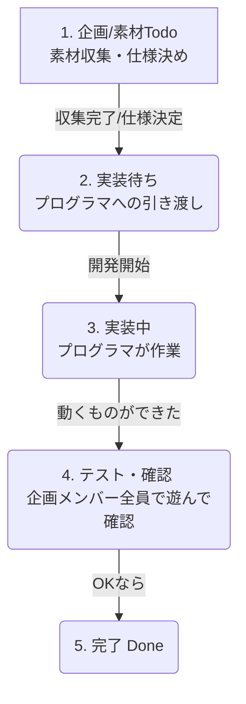

# 6人チーム（1人プログラマ＋5人企画・素材）のための GitHub Issues & Projects 運用ガイド

大学生6人（全員Godot初心者、プログラム担当はあなた1人、他5人は仕様検討・素材収集）で**2ヶ月という短期間でゲームを完成させるため**の、実践的な管理方法をまとめました。

この構成では、**「あなた（プログラマ）にタスクと負担が集中し、他の5人が何をすればいいか分からなくなる」**という罠に最も陥りやすいです。これを防ぐための運用方法を解説します。

---

## 1. チームの役割とGitHubの担当範囲

プログラムを書くのはあなた1人ですが、**GitHubのIssuesとProjectsは全員で使います。**

*   **企画・素材メンバー（5人）**:
    *   仕様書の作成、画像（スプライト、背景、UI）、音声（BGM、SE）の収集・作成。
    *   **「素材収集完了」「仕様決定」のIssueを作り、Projectsを動かす。**
*   **プログラマ（あなた）**:
    *   ゲームの実装。
    *   **「実装完了」のIssueを動かす。**

---

## 2. 2ヶ月スケジュールとマイルストーンの設計

2ヶ月（約8週間）は非常に短いです。以下のようにマイルストーン（目標）を切り分け、Projectsで管理します。

| 期間 | フェーズ | Projects上の目標（マイルストーン） |
| :--- | :--- | :--- |
| **第1〜2週** | **プロトタイプ期** | 動く最小のゲーム（自機が動いて弾が出て敵が消えるだけ）を作る。 |
| **第3〜5週** | **アセット統合期** | 5人が集めた本番素材（画像・音）をプログラムに入れ込む。 |
| **第6〜7週** | **ブラッシュアップ期**| メニュー画面、スコア、難易度調整、演出（エフェクト）の追加。 |
| **第8週** | **バグ修正・完成期** | ひたすらテストプレイとバグ修正。 |

---

## 3. 「企画・素材メンバー」用のIssueテンプレート

ノンプログラマのメンバーでも迷わず起票できるように、以下の2種類のテンプレートを共有してください。

### ① 素材（アセット）収集・作成用のIssue
素材担当が起票し、素材が揃ったらプログラマに渡すためのIssueです。

```markdown
## アセット内容
例: 自機（プレイヤー）がダメージを受けた時の効果音（SE）

## 素材の詳細
- **種別**: 効果音 (SE)
- **イメージ**: 「ピキーン」や「ドゴッ」という短い金属音・打撃音
- **ファイル形式**: `.wav` または `.ogg` (Godotで扱いやすい形式)

## 提出先 (いずれかにチェック)
- [ ] GitHubの `game/assets/sounds/` (または対応する `game/assets/` 内) フォルダに直接アップロードした
- [ ] Google Drive / Dropbox等の共有リンク: [リンクURLをここに貼る]
```

### ② 仕様検討用のIssue
ルールや画面レイアウトが決まったら起票するIssueです。

```markdown
## 検討内容
例: ゲームオーバー画面の表示項目と遷移ルール

## 決定した仕様
1. 自機のHPが0になったら、画面を暗転させて「GAME OVER」と表示する。
2. 画面には「今回のスコア」「ハイスコア」「タイトルに戻るボタン」「リトライボタン」を置く。
3. リトライボタンを押したら、すぐにステージ1を再開する。

## 📐 画面ラフ画像（あれば添付）
<!-- 手書きのワイヤーフレームや、参考ゲームのスクリーンショットなどを貼り付ける -->
```

---

## 4. Projects（プロジェクトボード）での連携フロー

「素材・仕様の決定」から「プログラムへの実装」への流れを、ボード上でスムーズに連携させます。

### ボードの構成とカードの動き方

ノンプログラマ用の列と、プログラマ用の列をわかりやすく分けます。



1.  **「企画・素材Todo」列** (担当: 5人のメンバー)
    *   「敵キャラクターの画像を5パターン集める」「BGMを決める」などのタスクカード。
2.  **「実装待ち（バックログ）」列** (担当: 全員 -> あなた)
    *   企画メンバーが素材を集め終わり、仕様が決まったらカードをここに移動させます。
    *   **ここに入ったカードが、あなたの「次に実装するタスクリスト」になります。**
3.  **「実装中」列** (担当: あなた)
    *   あなたが現在プログラムを書いているタスク。
4.  **「テスト・確認」列** (担当: 5人のメンバー)
    *   あなたが実装を終えて「テスト用ビルド（または実行用ファイル）」を渡したあと、企画メンバーに「実際に遊んでみて、イメージ通りか確認して！」と依頼して置く場所。
5.  **「完了（Done）」列**
    *   確認が取れて、無事にゲームに組み込まれたタスク。

---

## 5. 1人プログラマが潰れないための「鉄則」

5人の企画・素材メンバーからどんどん要望や素材が飛んでくると、あなた1人では裁ききれなくなります（ボトルネック化）。以下のルールをあらかじめチームで合意しておきましょう。

### 「素材のフォーマットとサイズ」を固定する
Godotにそのまま取り込める形式・サイズを事前に指定しておきます。
*   **画像**: 背景は〇×〇ピクセル、キャラクターは〇×〇ピクセル、形式は `.png`（背景透過）。
*   **音楽/効果音**: ループBGMは `.ogg`、効果音は `.wav`。
*   これ以外の形式で出された場合は「取り込めないから直して！」と差し戻すルールにします。

### 「必須（Must）」と「できれば（Want）」を分ける
2ヶ月しかないので、仕様検討の段階で「絶対にいるもの」と「時間が余ったらやりたいこと」を明確に区別します。
*   **Must**: 自機が動く、敵が出る、ダメージを食らう、リトライできる（これがないとゲームにならない）。
*   **Want**: 派手なパーティクルエフェクト、オンラインランキング、裏ボスなど（後回し）。
*   Projects上でカードに `Must` / `Want` のラベルを貼っておくと整理しやすいです。

### 毎週1回、動くゲームを全員で遊ぶ（進捗確認）
毎週のミーティングの際、あなたが実装した最新のゲーム画面を画面共有するか、実行ファイルを配布して全員で遊びます。
「動くもの」を見ることで、ノンプログラマのメンバーも「自分たちが集めた素材がどう使われているか」がわかり、モチベーションが跳ね上がります。また、その場で「ここをもっとこうしてほしい」という修正Issueをその場で起票できます。
